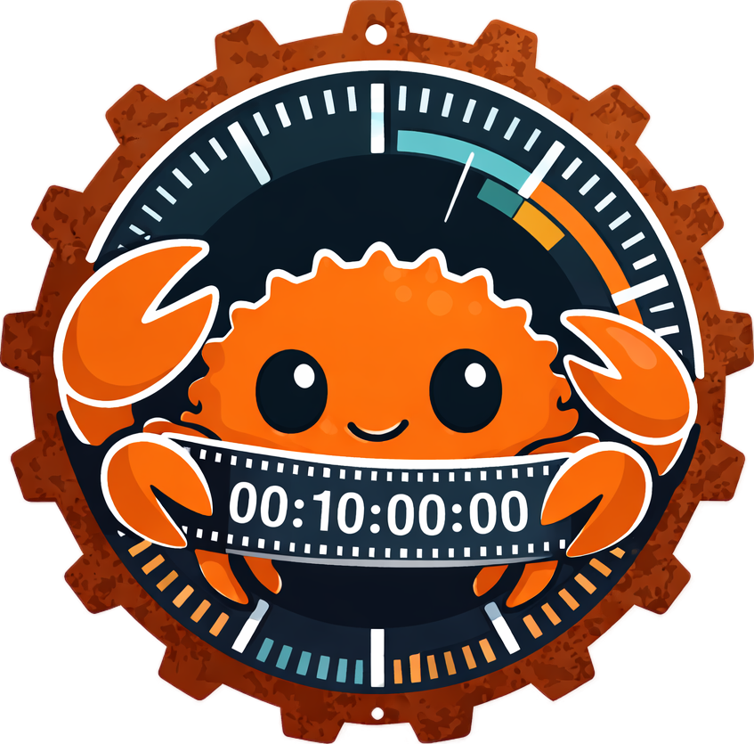

# RustyTAMS

A Rust implementation of the [Time-addressable Media Store (TAMS)](https://github.com/bbc/tams) API specification. Stores, queries, and serves segmented media using a microservices architecture that separates the metadata plane from the data plane.


## Quick Start

```bash
# Clone with submodules (TAMS spec + RustFS)
git clone --recurse-submodules <repo-url>
# Or if already cloned:
git submodule update --init

# Build everything (first RustFS build takes ~6 minutes)
make build && make build-rustfs

# Start all services (API, S3 store, auth, web UI)
make run-all

# Check they're running
make status

# Open the web UI
open http://localhost:5803    # login: test / password

# Browse the API docs (Swagger UI)
open http://localhost:5800/docs

# Try the API directly
curl -s -u test:password http://localhost:5800/service | python3 -m json.tool

# Run all tests (Rust + web)
make test

# Stop everything
make stop-all
```

## Prerequisites

- Rust (stable)
- Node.js (for web UI)
- Python 3 (for web UI backend and integration tests)
- AWS CLI (for S3 bucket creation during `make run-rustfs`)
- ffmpeg (for generating sample content)

## Services

| Service | Port | Description |
|---------|------|-------------|
| rustfs | 9000 | S3-compatible media object store (RustFS) |
| tams-server | 5800 | TAMS API (sources, flows, segments, webhooks) |
| tams-auth-server | 5802 | Auth (Basic auth, API keys, Bearer tokens) |
| tams-web | 5803 | Web UI (Svelte 5 SPA + Flask) |

## API Documentation

Interactive API docs are served at [http://localhost:5800/docs](http://localhost:5800/docs) via Swagger UI. The full OpenAPI spec is also available as YAML at [http://localhost:5800/api-spec](http://localhost:5800/api-spec).

The spec implements the [BBC TAMS API](https://github.com/bbc/tams) (v8.0, OpenAPI 3.1).

## Web UI

Record from webcam, upload files, play back via HLS, browse in a gallery, and assemble clips — all in the browser.

See [docs/web-ui.md](docs/web-ui.md) for full feature list and [docs/walkthrough.md](docs/walkthrough.md) for a step-by-step guide.

## Documentation

- [Architecture](docs/architecture.md) — service diagram, crate structure, TAMS spec flow
- [Web UI](docs/web-ui.md) — features, quick start, tech stack
- [Walkthrough](docs/walkthrough.md) — step-by-step guide with screenshots
- [Configuration](docs/configuration.md) — CLI arguments, default credentials
- [Integration Tests](docs/integration-tests.md) — end-to-end testing with BBC TAMS scripts

## Make Targets

Run `make help` for the full list. Key targets:

```
make build              Build all Rust crates
make test               Run all tests (Rust + web)
make run-all            Start all services
make stop-all           Stop all services
make check              Full CI check (format + lint + test)
make clean-data         Remove all data (flows, segments, media)
make install-web        Install web UI dependencies
make check-web          Full web UI check (lint + test + build)
make integration-test   End-to-end integration test
```

## License

See [LICENSE](LICENSE) for details.
