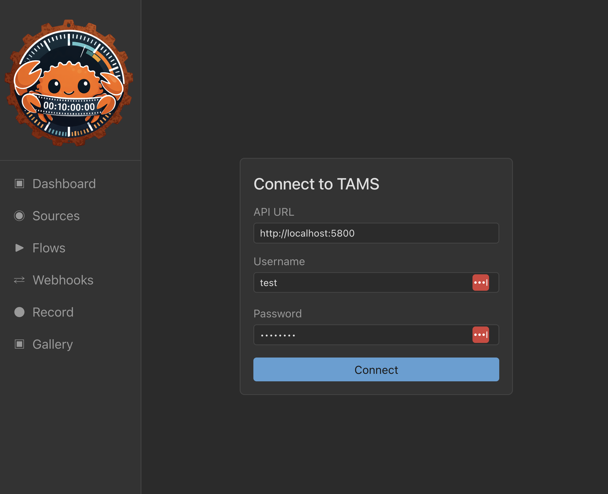
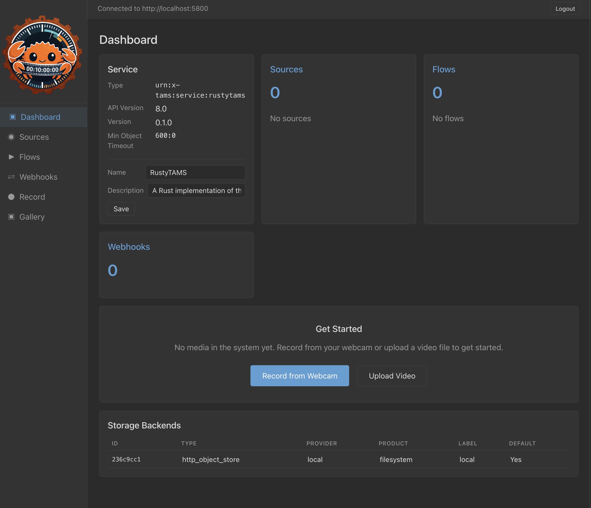
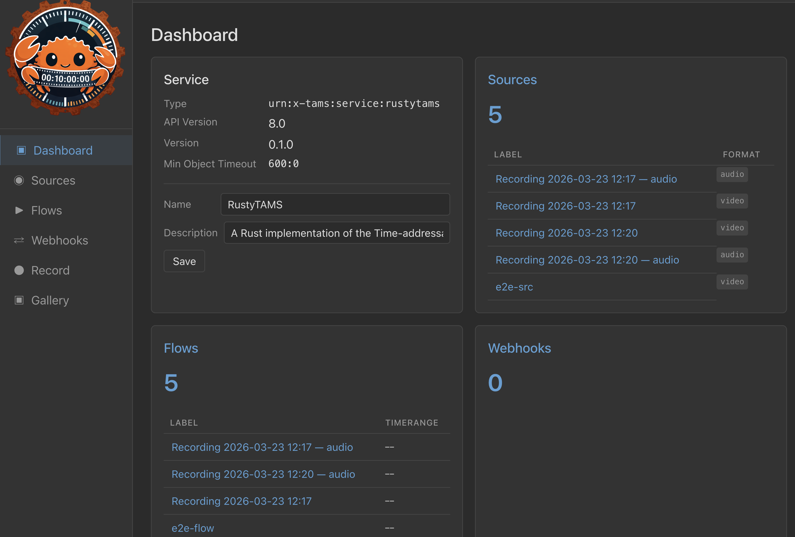
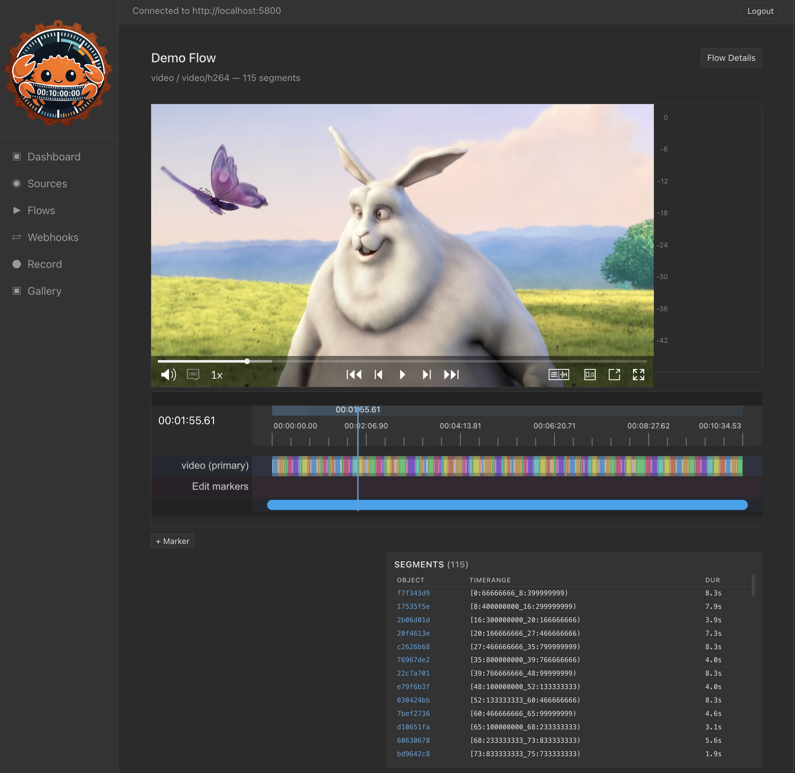
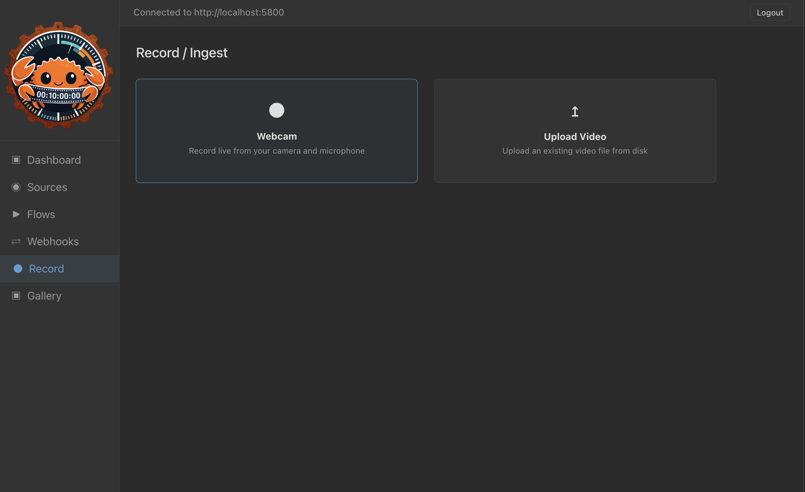
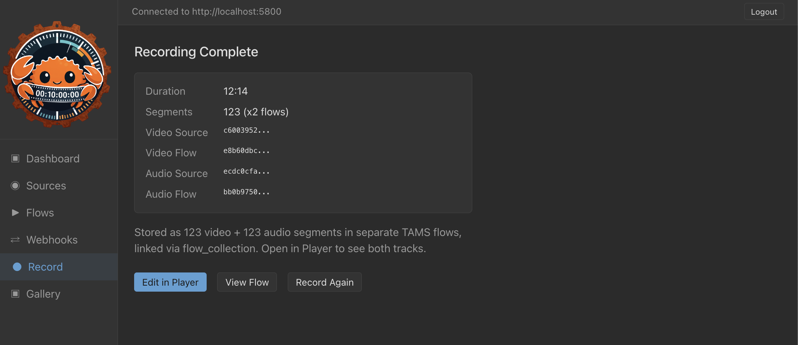
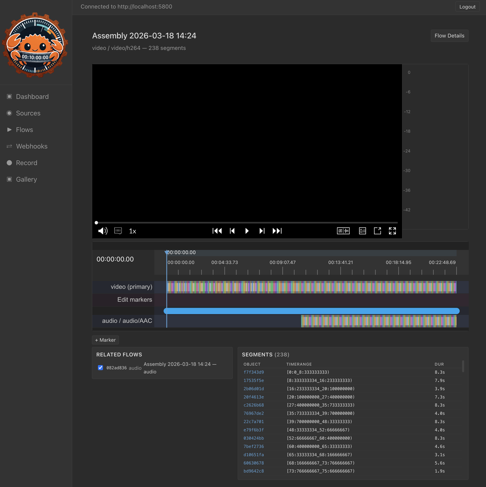

# RustyTAMS Walkthrough

A step-by-step guide to using the RustyTAMS web UI. This walkthrough covers logging in, ingesting content via the API and file upload, playback, and creating assemblies from multiple flows.

## Prerequisites

Start all services and open the web UI:

```bash
make run-all
open http://localhost:5803
```

## 1. Login

Enter the API URL, username and password, then click Connect.

Default credentials: `test` / `password`



## 2. Dashboard

After login you see the dashboard with service info, source/flow counts, webhooks, and storage backends. On a clean system there is no content yet.



## 3. Ingest Content via API

The BBC TAMS examples include an HLS ingest script that uploads Big Buck Bunny segments directly to the API:

```bash
source venv/bin/activate
python tams/examples/ingest_hls.py \
  --tams-url http://localhost:5800 \
  --hls-filename tams/examples/sample_content/hls_output.m3u8 \
  --hls-segment-count 115 \
  --username test --password password
```

After ingestion the dashboard shows 1 source and 1 flow.



## 4. Play Back Content

Click on a flow to open it in the player. The player shows the video via HLS, a timeline with segment markers, and a segment list.



## 5. Upload a File

Navigate to Record / Ingest and choose Upload Video.



Select a video file (MP4 with H.264 video and AAC audio). The UI probes the file and shows duration and segment count.


Click Upload & Ingest. The file is transcoded in the browser using WebCodecs and uploaded as MPEG-TS segments. Video and audio are stored as separate TAMS flows linked via `flow_collection`.


When complete you see the flow IDs for both video and audio.



## 6. Play Uploaded Content

The uploaded flow plays back with both video and audio tracks. The audio track appears in the timeline and the related audio flow is listed.


## 7. Create an Assembly

Open the Gallery, select flows by clicking the checkmark, then drag to reorder in the assembly bar. Give it a name and click Create Assembly.


The assembly creates a new video flow (and audio flow if all source flows have audio) that references the original media segments at shifted timeranges.



## Notes

- **Audio codec support**: The browser-based transcoder (mediabunny/WebCodecs) supports AAC audio. Files with MP3 audio (e.g. older MOV files) will show an error during the file probe step with instructions to convert using ffmpeg.
- **Assemblies with mixed audio**: If some source flows have audio and others don't, the assembly is created as video-only. This is a limitation of HLS playback which requires audio and video timelines to be fully aligned.
- **Sample content**: Big Buck Bunny and Tears of Steel are Creative Commons films from the Blender Foundation.
