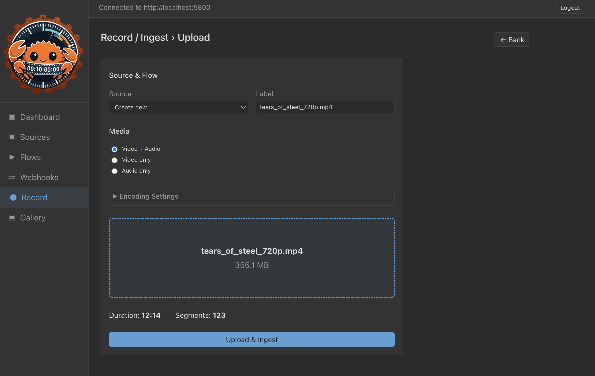
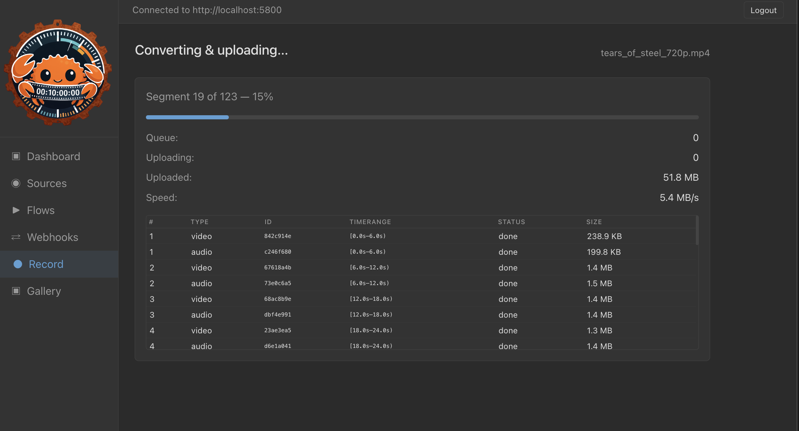
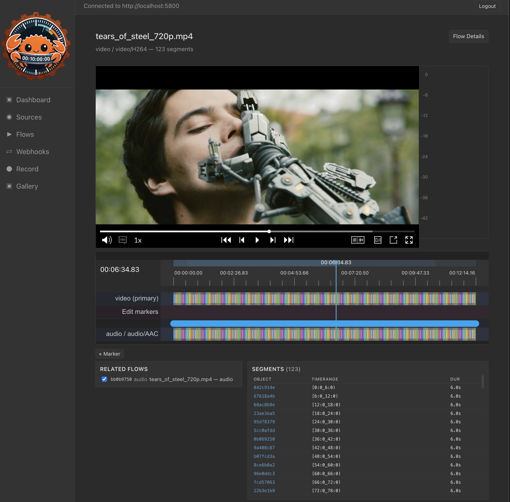
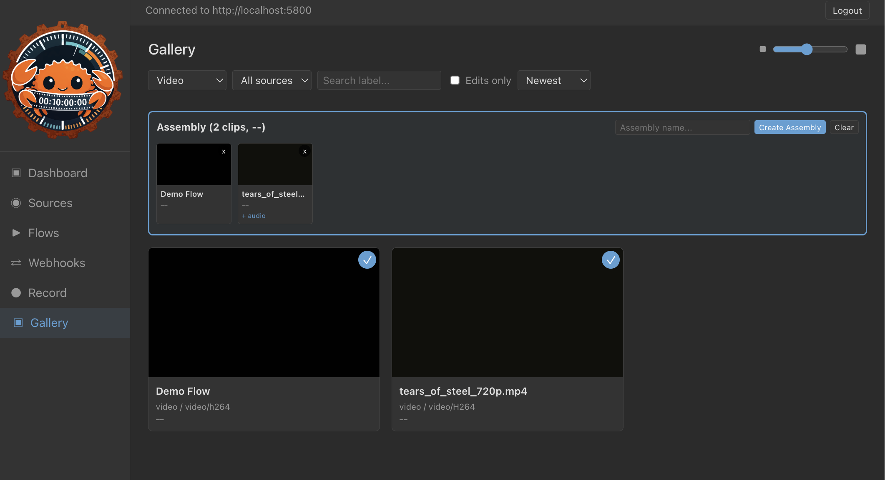

# Web UI

RustyTAMS includes a full web interface for managing media, built with Svelte 5 (TypeScript) and Python/Flask.

## Features

### Record / Ingest

Webcam recording and file upload with browser-based transcoding via WebCodecs.



- Configurable video codecs (H.264, H.265) and audio (AAC)
- Quality presets from 1 Mbps to 50 Mbps, plus I-frame only mode
- Frame rates including NTSC fractional (23.976, 29.97, 59.94) as exact rationals
- Configurable keyframe interval and segment duration
- Video+Audio / Video only / Audio only modes
- Per-segment upload tracking with queue, speed, and progress stats
- Settings persistence to localStorage with "Save as Defaults"
- Async codec capability detection (greys out unsupported codecs)



### Player

HLS playback via Omakase Player with frame-accurate timeline and audio monitoring.



- Timeline with segment markers and scrubber
- VU meter (audio level monitoring)
- Segmentation editing (add/remove/drag markers)
- Segment export to new TAMS flow
- Related flows (flow_collection + same-source discovery)
- Master HLS playlists for synced audio/video playback
- Presigned URL refresh (10-minute interval)
- Overlap detection for markers

### Gallery

Media browser with thumbnails, filtering, and assembly creation.



- Card grid with lazy-loaded video thumbnails (adaptive Range fetch, IDR fallback)
- Tile size slider (120-400px, persisted)
- Infinite scroll with paginated flow loading
- Filters: format, source, label search, date, edits only
- Sort: newest, oldest, longest, shortest, label A-Z
- Thumbnail progress bar
- Assembly: select video flows, drag to reorder, create contiguous assembly with auto-linked audio

## Quick Start

```bash
# Install frontend dependencies
make install-web

# Build frontend
make build-web

# Run all web UI tests
make test-web

# Start all services including web UI
make run-all

# Open http://localhost:5803 (login: test / password)
```

## Make Targets

```
make install-web        Install npm dependencies
make build-web          Build frontend (Vite)
make test-web           Run all web UI tests (vitest + pytest)
make test-web-js        Run frontend TypeScript tests only (vitest)
make test-web-flask     Run Flask backend tests only (pytest)
make lint-web           Lint web UI (ruff + build warnings)
make format-web         Format Python code (ruff)
make check-web          Full web UI check (lint + test + build)
make web-venv           Create Python venv for Flask
make web-fixtures       Populate TAMS with test data
```

## Tech Stack

- **Frontend**: [Svelte 5](https://svelte.dev/) (MIT), [TypeScript](https://www.typescriptlang.org/) (Apache 2.0), [Vite](https://vite.dev/) (MIT)
- **Backend**: [Python](https://www.python.org/) (PSF), [Flask](https://flask.palletsprojects.com/) (BSD 3-Clause)
- **Player**: [@byomakase/omakase-player](https://github.com/byomakase/omakase-player) (Apache 2.0), [HLS.js](https://github.com/video-dev/hls.js) (Apache 2.0)
- **Encoding**: [mediabunny](https://github.com/Vanilagy/mediabunny) (MPL 2.0), [WebCodecs](https://developer.mozilla.org/en-US/docs/Web/API/WebCodecs_API) (W3C)
- **Testing**: Vitest (407 tests), Pytest (8 tests)
